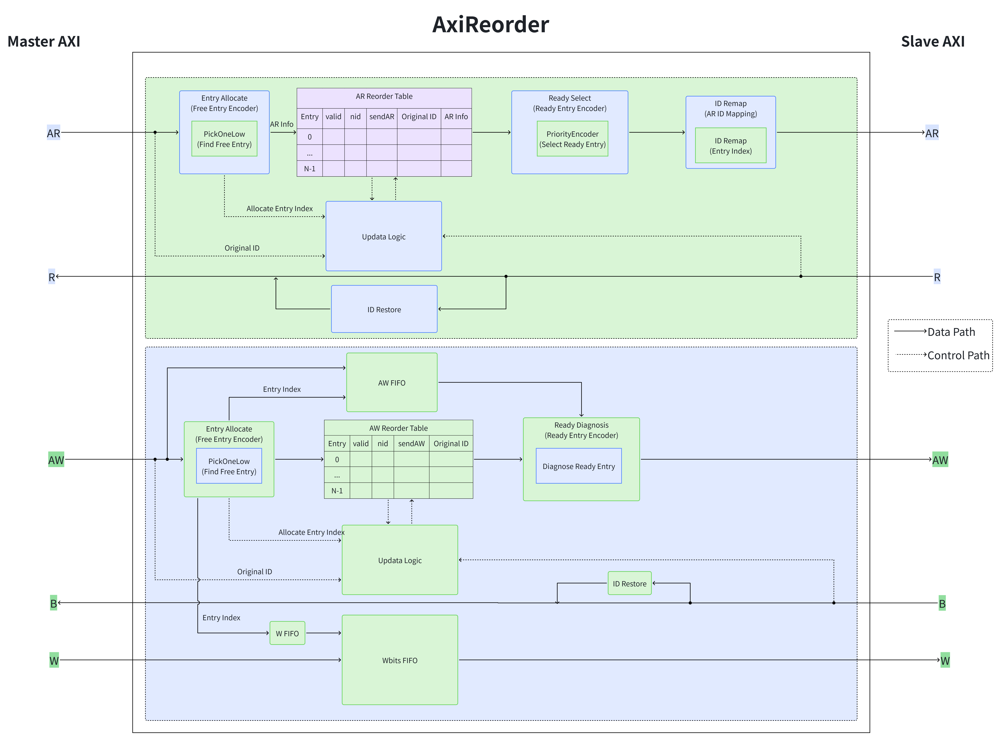
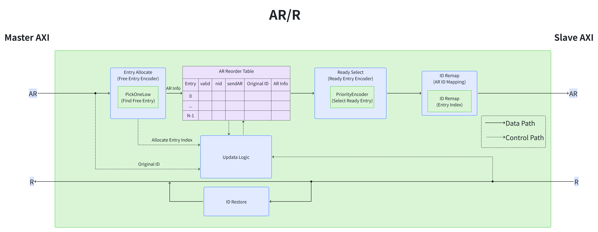
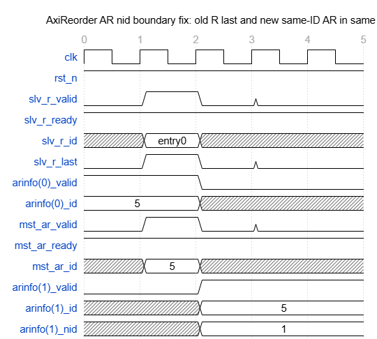
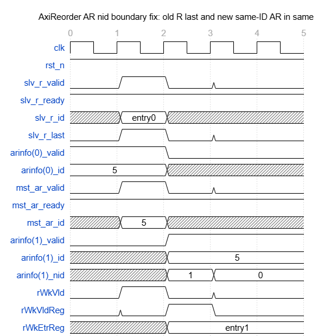
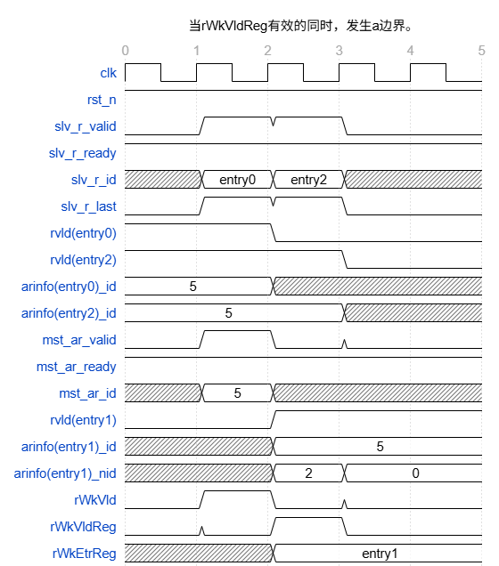
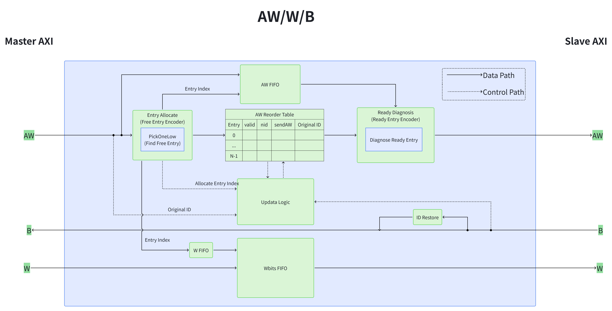

# DS-ZhujiangNG-AxiReorder

---

## 文档审批信息

| 角色 | 签名 |
|------|------|
| 编写 |      |
| 校对 |      |
| 审核 |      |
| 批准 |      |
| 日期 |      |

## 文档修订记录

| 序号 | 版本编号 | 状态变化 | 更变说明 | 源码基线 commit | 作者 | 日期 |
|------|----------|----------|----------|----------------|------|------|
| 1 | 待定 | C | 创建 AxiReorder 设计说明 | fc44d655ed7f1917702ab6987e0af090f6a8e896 | AxiReorder.scala | 2026.07.01 |

> 状态变化：C——创建，A——增加，M——修改，D——删除

### 变更明细

#### 待定 (2026.07.01)

- [A] 创建 AxiReorder 模块设计规格、总体设计、详细设计、PPA 说明和验证关注点 → [§1](#1-简介)

---

## 目录

- [1. 简介](#1-简介)
- [2. 设计规格](#2-设计规格)
- [3. 功能描述](#3-功能描述)
- [4. 总体设计](#4-总体设计)
- [5. 详细设计](#5-详细设计)
- [6. PPA 优化设计](#6-ppa-优化设计)
- [7. 验证关注点](#7-验证关注点)
- [8. Floorplan 建议](#8-floorplan-建议)
- [9. 遗留问题](#9-遗留问题)

---

## 1. 简介

### 1.1 文档介绍

本文档描述 `xs.infra.axi.AxiReorder` 模块的设计。该模块位于 AXI 互连或 AXI 适配路径中，上游侧接口命名为 `mst`，下游侧接口命名为 `slv`；模块接收上游 AXI 事务，向下游发送重编码后的事务 ID，并在读响应和写响应返回时恢复上游原始 ID。

本文档覆盖模块参数约束、接口行为、读写通道重排序控制、内部队列与状态元素、响应 ID 恢复、不变量和验证关注点。目标读者包括 RTL 设计人员、验证人员、集成人员和后端实现人员。

> **📝 评审意见：**
>
> _（请在此处填写评审意见）_

### 1.2 术语说明

| 缩写 | 全称 | 描述 |
|---|---|---|
| AXI | Advanced eXtensible Interface | Arm AMBA 总线协议族中的高性能内存映射接口 |
| AR | AXI Read Address | 读地址通道 |
| R | AXI Read Data | 读数据响应通道 |
| AW | AXI Write Address | 写地址通道 |
| W | AXI Write Data | 写数据通道 |
| B | AXI Write Response | 写响应通道 |
| ID | Transaction Identifier | AXI 事务标识，用于区分 outstanding 事务 |
| nid | Number of same-ID predecessors | 同 ID 未完成前序事务计数，用于保证同 ID 顺序 |
| fire | valid && ready | Decoupled 接口一次成功握手 |
| entry | Reorder Table Entry | 重排表表项，用于保存一笔 outstanding 事务的信息。entry 编号会作为 slave 侧事务 ID 使用，响应返回时通过该编号查表恢复 master 原始 ID。 |

> **📝 评审意见：**
>
> _（请在此处填写评审意见）_

## 2. 设计规格

#### 接口规格

|通道|方向|描述|
|---|---|---|
|m_aw|上游->模块|AXI 写地址通道，接收上游写请求地址、ID、burst 属性等信息|
|m_ar|上游->模块|AXI 读地址通道，接收上游读请求地址、ID、burst 属性等信息|
|m_w|上游->模块|AXI 写数据通道，接收上游写数据、写字节使能、last 和 user 信息|
|m_b|模块->上游|AXI 写响应通道，向上游返回写响应，并将响应 ID 恢复为上游原始AW ID|
|m_r|模块->上游|AXI 读响应通道，向上游返回读数据和读响应，并将响应 ID 恢复为上游原始 AR ID|
|s_aw|模块->下游|AXI 写地址通道，向下游发送写请求地址、burst 属性等信息，并将 ID 改写为内部写 entry 编号|
|s_ar|模块->下游|AXI 读地址通道，向下游发送读请求地址、burst 属性等信息，并将 ID 改写为内部读 entry 编号|
|s_w|模块->下游|AXI 写数据通道，向下游发送写数据、写字节使能、last 和 user 信息|
|s_b|下游->模块|AXI 写响应通道，接收下游写响应，响应 ID 被解释为内部写 entry 编号|
|s_r|下游->模块|AXI 读响应通道，接收下游读数据和读响应，响应 ID 被解释为内部读 entry 编号|

> **📝 评审意见：**
>
> _（请在此处填写评审意见）_

---

## 3. 功能描述

**功能描述：**AXI 允许不同 ID 的事务乱序返回，但要求同一 ID 的事务在协议约束下保持顺序。`AxiReorder` 的核心思想是将上游原始 ID 映射为内部 entry ID 后发送给下游，使每个 outstanding 事务在下游侧拥有唯一可索引的返回 ID；当响应返回时，模块用 entry 查表恢复上游原始 ID。

> **📝 评审意见：**
>
> _（请在此处填写评审意见）_

---

## 4. 总体设计

### 4.1 整体框图



*图 4.1  AxiReorder 模块整体框图*

> **📝 评审意见：**
>
> _（请在此处填写评审意见）_

## 5. 详细设计

重排id逻辑：建立重排AR和AW重排表，master侧使用原id，slave侧使用重排表的表项编号作为事务id。返回数据时，通过查表还原原id。

#### AR/R通道



*图 5.1  AxiReorder 模块AR和R通道框图*


#### AR重排逻辑

AR重排表信息包括valid（有效信号）、master读地址通道信息（包括id、addr、size等）、nid（重排顺序）和sendAR（已经发送给slave的指示信号）。

- AR接受：

    - 当存在空闲表项时，master地址通道的ready信号置高。

    - 当master地址通道握手成功时，分配一个表项，保存master读地址通道信息。

    - 统计当前已有相同 ID 的读事务数量，写入 nid。

    - 表项的valid置1，sendAR置0。

    - 若不存在valid为0的表项，master地址通道的ready信号会一直拉低，避免握手成功丢失信息。

    - 分配表项规则，采用低编号优先策略。

- AR发送：

    - AR 重排表中 valid=1、sendAR=0 且 nid=0 的表项，即为"待发送"表项。

    - 只要存在至少一个待发送表项，就把 slave AR 通道的 valid 拉高；同时从这些表项中选出一个，将其 AR 信息发往 slave。

    - AR 的 id → 用该表项的表内编号替代。

    - slave AR通道的ready为0，该表项不会被标记被发送，下一拍继续尝试发送，直到握手成功。

    - 选择规则：采用固定优先级编码器。（推荐采用轮询仲裁器，因为极端情况可能会有表项的AR信息发送不出去。）

- R返回：

    - R通道除id信号外，其他信号采用直接连接的方式连通通道。

    - Slave R通道返回id需要在AR重排表里查找正确的master R通道的id。

- AR重排表更新逻辑

    - valid更新：slave R通道的最后一个数据返回时，将R通道的id对应的AR重排表的表项的valid置0（说明该事务执行完毕）。

    - sendAR更新：master AR通道握手成功，sendAR置0；slave AR通道握手成功，sendAR置1。

    - nid更新：

        - master AR通道握手成功，统计当前已有相同 ID 的读事务数量，写入 nid。

        - 当 slave R 通道返回某个读事务的最后一个数据且握手成功时，表示该读事务已经完成。模块使用 R 返回 ID定位对应的 AR重排表表项编号，并读取其中保存的原始 master AR ID。随后模块遍历所有有效的 AR 重排表表项，对保存了相同原始 ID 且 nid 非 0 的表项执行 nid - 1。这里的 nid 表示该表项前方尚未完成的同 ID 读事务数量。因此，每完成一个同 ID 的前序读事务，后续同 ID 事务的 nid 就会减少 1；只有当 nid 变为 0 后，该事务才允许向 slave 发送 AR 请求。通过这种方式，模块保证 master 侧同 ID 读事务按顺序进入 slave 并按顺序完成。

        - 两种nid更新的边界条件：（该边界目前通过 rWkVldReg/rWkEtrReg 下一拍修正 nid。理论上也可考虑在 nid 计算路径中直接扣除同周期完成项，但需要进一步评估组合路径和更新优先级。实现方法：在原来更新nid的时序逻辑中增加新的条件判断来处理，这样仅是增加了电路的开关信号，没有引入新的寄存器）

            - 当salve R通道的最后一个数据返回的同时，master AR通道发送了一笔同id的读事务。
   


                - salve R通道最后一笔数据在第二个上升沿握手成功，master也在第二个上升沿发来同id读事务。由于寄存器，arinfo(1)会记录到与arinfo\(0\)是同id，所以arinfo(1)_nid会为1。但是由于nid更新条件，所以会导致arinfo(1)_nid不会在变为0。因此需要为这个边界加入一些指示信号。



                - 加入rWkVld、rWkVldReg和rWkEtrReg信号，用于处理边界。

                - rWkVld是组合逻辑

                ```Scala
                rWkVld=(slv_r_valid && slv_r_ready) && (mst_ar_valid && mst_ar_ready) && slv_r_last && mst_ar_id === arinfo(slv_r_id)_id
                ```

                - rWkVldReg是对rWkVld信号打一拍，主要为指示对哪一个表项的nid进行减一。

                - rWkEtrReg是寄存器，主要在rWkVld有效时，保存master AR通道的读事务填入AR重排表的哪一个表项，为下一拍，对该表项的nid进行减一。

            - 当rWkVldReg有效的同时，发生a边界。


                  - 在第三个上升沿，如果按a边界条件下考虑，就会导致其只减一。因此在其条件判断语句中需要加入此种情况，在此种边界情况下，对nid进行减2。



> **📝 评审意见：**
>
> _（请在此处填写评审意见）_

---

#### AW/W通道



#### AW重排逻辑

AW重排表信息包括valid（有效信号）、master写地址id、nid（重排顺序）和sendAW（已经发送给slave的指示信号）。

- AW接收：

    - AW重排表、aw_FIFO、w_FIFO有空位，说明模块可以接受master的AW通道信息，拉高m_awready。

    - 当master地址通道握手成功时，在列表中寻找valid为0的表项将信息填入重排表。

    - 当master地址通道握手成功时，master的AW通道信息和表项编号要压入aw_FIFO，表项编号压入w_FIFO。

- AW发送：

    - 当aw_FIFO读出的（即队头）满足valid=1、sendAW=0 且 nid=0 时，拉高s_awvalid。握手成功后，弹出aw_FIFO，把对应表项的sendAW置1。

- W接收和发送：

    - wbits_FIFO不满且w_FIFO非空时，拉高m_wready。W通道握手成功后，将W通道信息压入wbits_FIFO，若握手时是最后一个数据，w_FIFO弹出。

    - wbits_FIFO不空且对应事务的AW信息已经发送给slave时，拉高s_wvalid。W通道握手成功后，将W通道信息弹出wbits_FIFO。

- B返回：

    - B通道除id信号外，其他信号采用直接连接的方式连通通道。

    - Slave B通道返回id需要在AW重排表里查找正确的master B通道的id。

- AW重排表更新逻辑

    - valid更新：slave B通道返回并握手成功时，说明该事务执行完毕，将表项的valid拉低。

    - nid更新：

        - master AW通道握手成功，统计当前已有相同 ID 的写事务数量，写入 nid。

        - 当 slave B 通道返回某个写事务的响应且握手成功时，表示该写事务已经完成。模块使用 B 返回 ID定位对应的 AW重排表表项编号，并读取其中保存的原始 master AW ID。随后模块遍历所有有效的 AW 重排表表项，对保存了相同原始 ID 且 nid 非 0 的表项执行 nid - 1。这里的 nid 表示该表项前方尚未完成的同 ID 写事务数量。因此，每完成一个同 ID 的前序写事务，后续同 ID 事务的 nid 就会减少 1；只有当 nid 变为 0 后，该事务才允许向 slave 发送 AW 请求。通过这种方式，模块保证 master 侧同 ID 写事务按顺序进入 slave 并按顺序完成。

        - 两种nid更新的边界条件，与读通道一致。


> **📝 评审意见：**
>
> _（请在此处填写评审意见）_

---

## 6、PPA优化设计

> **📝 评审意见：**
>
> _（请在此处填写评审意见）_

---

## 7、验证关注点

- 关注点

    - AR/AW 重排表分配    master AR/AW 握手后必须分配一个空表项，保存原始 AR/AW 信息，valid 置 1

    - AR/AW ID 改写       发往 slave 的 ar_id/aw_id 必须是内部 entry 编号，不是原始 master ID

    - R/B ID 恢复        slave R/B 返回时，master 侧看到的 rid/bid 必须恢复为原始 AR/AW ID

    - entry 释放       只有 R/B 通道 last beat fire 时，才释放对应 valid

    - 同 ID 保序     同一个 master AR/AW ID 的多个读事务，必须按 master 发起顺序发送到 slave

    - 不同 ID 并发     不同 ID 的读事务可以并发，不应被错误阻塞

    - nid 更新         前序同 ID R/B last 返回后，后续同 ID entry 的 nid 必须减 1

    - 同周期冲突       AR/AW 握手 和 R/B 最后一笔数据握手同周期发生时，rWkVld 修正逻辑必须正确

    - 反压     master/slave 任意拉低 ready 时，不应丢请求、重复请求或提前释放表项内容

    - 重排表满        所有表项占满时，m_arready/m_awready 应该拉低

- 测试用例

    - 同id用例：用于验证同 ID 保序，nid 更新。

    - 不同id用例：用于验证不同 ID 并发。

    - 混合id用例：综合验证。 


> **📝 评审意见：**
>
> _（请在此处填写评审意见）_

---

## 8、Floorplan建议

> **📝 评审意见：**
>
> _（请在此处填写评审意见）_

---

## 9、遗留问题

### 代码问题

第一个是代码疑点：

  val bFireSlvHit =
    io.slv.b.fire &&
    arinfo(slvBHitEtr).bits.id === awinfo(i).id &&
    wvld(i)

这里 B 路径更新AW重排表 nid，使用 arinfo 很可疑，应该使用 awinfo。

第二个是 desiredName：

  override val desiredName = "AxiRecoder"

  模块叫 AxiReorder，但 desiredName 是 AxiRecoder，可能是拼写历史遗留，列为待确认。

### 设计问题

    - aw_FIFO的深度是1、w_FIFO的深度是2，为什么这样设计？建议深度和重排表的buffer一样。为什么这样建议呢，因为FIFO深度小于buffer就会导致重排表填不满；而FIFO深度大于buffer就会导致，重排表满了，但是FIFO没满，也会导致浪费。

    - nid边界的处理：该边界目前通过 rWkVldReg/rWkEtrReg 下一拍修正 nid。理论上也可考虑在 nid 计算路径中直接扣除同周期完成项，但需要进一步评估组合路径和更新优先级。实现方法：在原来更新nid的时序逻辑中增加新的条件判断来处理，这样仅是增加了电路的开关信号，没有引入新的寄存器

> **📝 评审意见：**
>
> _（请在此处填写评审意见）_

---